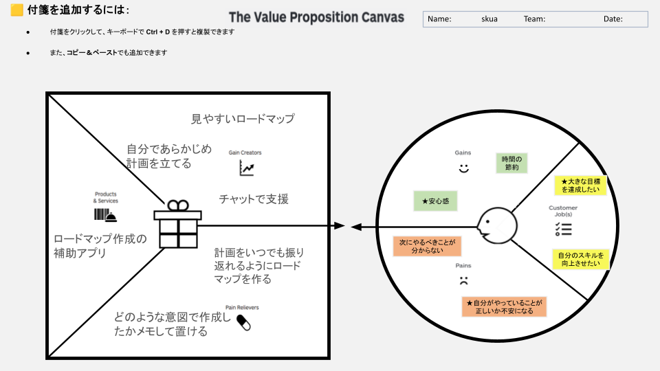

# VPC v1 - skua2103

> 「**自分や周りの人を顧客に設定**」したVPC。13週後の自分が欲しいもの・身近な人のために作りたいものを設計する。
> v1 でいい。完璧を目指さない。第6回でアップデート(v2)します。

---

## 1. 解決したい困りごとを 1つ 選ぶ

> [`bug-list.md`](./bug-list.md) の20個から、**「自分が一番これを解決したい!」と思うもの** を1つ選んでください。
> 1つに絞れなければ、複数候補を書いてOK(後で絞り込みます)。

**選んだ困りごと**:

やらなければいけないタスクがあっても何をやればいいか分からず停滞してしまう

---

## 2. その解決策のアイデアを書く

> 選んだ困りごとに対する「**こうだったらいいのに**」を1つ書く。
> 現実性は気にせず、自由に発想。

**解決のアイデア**:

自分であらかじめ計画を立てられ、いつでも振り返れるような見やすいロードマップを作成し、チャットで支援してくれるアプリ。

---

## 3. VPC本体

> 上で選んだ「困りごと」と「解決のアイデア」を起点に、6要素を埋めていきます。

### 🟦 Customer Profile(顧客=自分自身)

#### Jobs(やりたいこと・動詞で書く)

- ★大きな目標を達成したい
- 自分のスキルを向上させたい
- (Job 3)

#### Pains(困っていること)

- 次にやるべきことが分からない
- ★自分がやっていることが正しいか不安になる
- (Pain 3)

#### Gains(得たい未来・状態)

- 時間の節約
- ★安心感
- (Gain 3)

---

### 🟧 Value Map(あなたが作るもの)

#### Products & Services

- ロードマップ作成の補助アプリ

#### Pain Relievers

- どのような意図で作成したかメモして置ける
- (Pain Reliever 2)
- (Pain Reliever 3)

#### Gain Creators

- 見やすいロードマップ
- チャットで支援
- 自分であらかじめ計画を立てる
- 計画をいつでも振り返れるようにロードマップを作る

---

## 4. Fit確認(整合チェック)

| Pains/Gains | ↔ | Pain Relievers / Gain Creators | チェック |
|---|---|---|---|
| 次にやるべきことが分からない | ↔ | 見やすいロードマップ / 自分であらかじめ計画を立てる | ✓ |
| 自分がやっていることが正しいか不安になる | ↔ | チャットで支援 / 計画をいつでも振り返れるようにロードマップを作る | ✓ |
| 安心感 | ↔ | チャットで支援 / どのような意図で作成したかメモして置ける | ✓ |
| 時間の節約 | ↔ | ロードマップ作成の補助 / 計画の振り返り | ✓ |
| 大きな目標を達成したい | ↔ | ロードマップ作成 | ✓ |

> 整合しないものは「自分が作りたいだけ」のプロダクトになりがち。
> 迷ったら AI大学講師に壁打ち。
